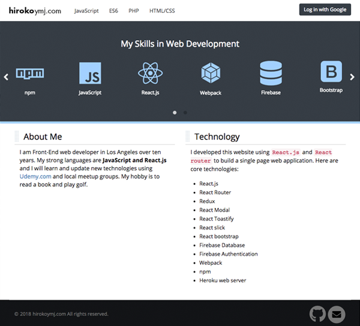
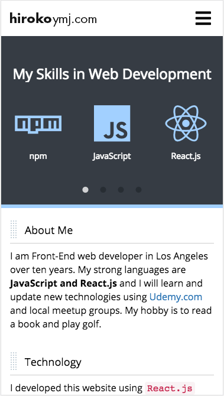

# React.js web application - hirokoymj.com

### Live URL

[http://www.hirokoymj.com](http://www.hirokoymj.com)

### Core technologies: 

- React.js
- React Router
- Redux
- React Slick Slider
- React Modal
- React Toastify
- Firebase database
- Firebase authentication
- Bootstrap grid system
- Sass
- Webpack
- npm
- Heroku web server

### Description
I developed hirokoymj.com to share my technical articles. It is a single page web application built with React.js.

### Screenshot

## References:
- [How to push the react app to Heroku Server](Heroku.md)

 

